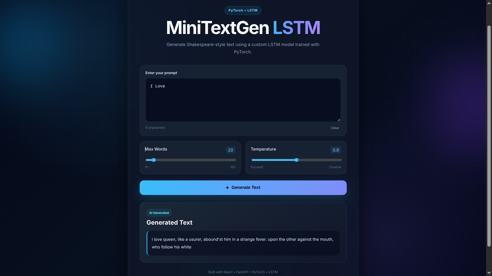
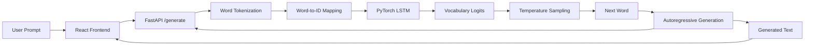
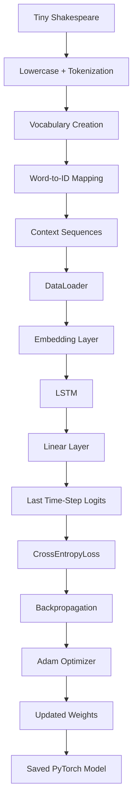
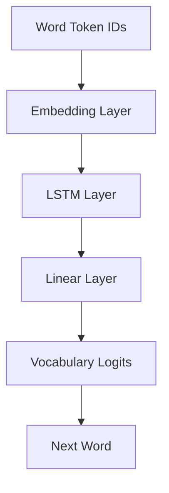
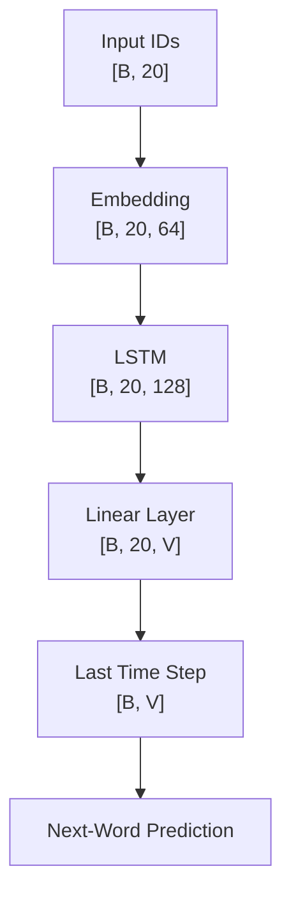
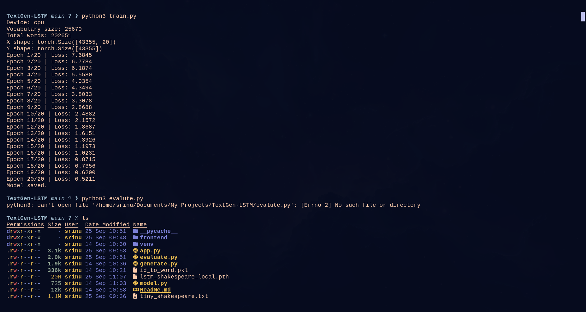
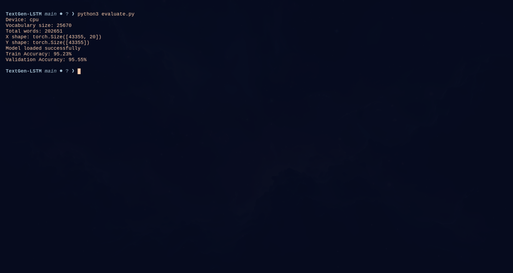
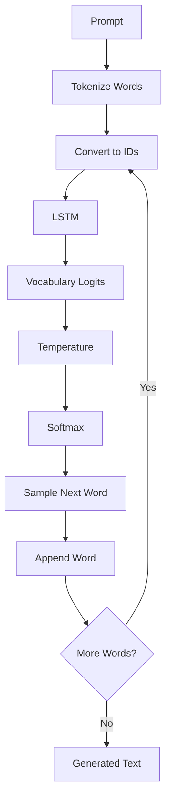
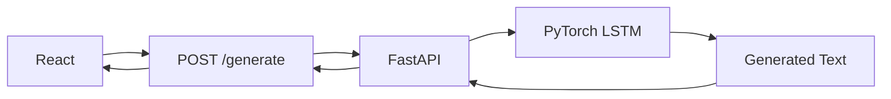

# MiniTextGen-LSTM

A full-stack **word-level text generation project** built with **PyTorch LSTM**, trained on the **Tiny Shakespeare** dataset, served through **FastAPI**, and connected to a modern **React frontend**.

This project was created to understand how recurrent neural networks process sequential text, preserve context using hidden and cell states, predict the next word, and generate text autoregressively.

---

## Project Demo



### Example

**Prompt**

```text
I love
```

**Generated Output**

```text
i love perform'd this us? unto dead blow to seem o'er strength...
```

The generated text follows Shakespeare-style vocabulary because the model was trained on the Tiny Shakespeare corpus.

---

## Project Highlights

- Word-level text generation
- PyTorch LSTM implementation
- Tiny Shakespeare dataset
- Local CPU training
- Vocabulary creation
- Sequence preparation
- Embedding layer
- Hidden and cell state learning
- Next-word prediction
- Autoregressive generation
- Temperature sampling
- Configurable generation length
- FastAPI inference backend
- React frontend
- Training and evaluation scripts
- Model saving and loading

---

## Complete System Architecture



---

## Training Pipeline



---

## Dataset

The project uses the **Tiny Shakespeare** dataset.

Tiny Shakespeare contains text from Shakespeare's plays and is commonly used for language-modeling and sequence-learning experiments.

Example:

```text
From fairest creatures we desire increase
```

After preprocessing:

```text
from fairest creatures we desire increase
```

Tokenized:

```text
["from", "fairest", "creatures", "we", "desire", "increase"]
```

---

## Dataset Statistics

Current local training configuration:

```text
Total Words        : 206,251
Vocabulary Size    : 25,670
Training Sequences : 43,355
Sequence Length    : 20
```

Input tensor shape:

```text
[43355, 20]
```

Target tensor shape:

```text
[43355]
```

Each training sample contains:

```text
20 input words
↓
predict the next word
```

---

## Text Preprocessing

```text
Raw Shakespeare Text
        ↓
Lowercase Conversion
        ↓
Whitespace Tokenization
        ↓
Vocabulary Creation
        ↓
Word-to-ID Mapping
        ↓
20-Word Context Windows
        ↓
Next-Word Target
```

Example:

```text
Input:
the king is coming home

Target:
today
```

The model receives previous words and learns to predict the next word.

---

## Vocabulary

Each unique word is assigned a numerical ID.

Example:

```text
king   → 1024
queen  → 1842
lord   → 905
```

The project stores two vocabulary mappings:

```text
word_to_id.pkl
id_to_word.pkl
```

These mappings must stay consistent with the trained model.

---

## Model Architecture



Current model:

```python
import torch
import torch.nn as nn


class LSTMTextModel(nn.Module):

    def __init__(self, vocab_size, embedding_dim, hidden_size):
        super().__init__()

        self.embedding = nn.Embedding(
            vocab_size,
            embedding_dim
        )

        self.lstm = nn.LSTM(
            input_size=embedding_dim,
            hidden_size=hidden_size,
            batch_first=True
        )

        self.fc1 = nn.Linear(
            hidden_size,
            vocab_size
        )

    def forward(self, x, hidden=None):

        embedded = self.embedding(x)

        output, hidden = self.lstm(
            embedded,
            hidden
        )

        logits = self.fc1(output)

        return logits, hidden
```

---

## Model Configuration

```text
Sequence Length     : 20
Embedding Dimension : 64
Hidden Size         : 128
Batch Size          : 32
Epochs              : 20
Optimizer           : Adam
Learning Rate       : 0.001
Loss Function       : CrossEntropyLoss
Device              : CPU
```

---

## Tensor Flow



Where:

```text
B = batch size
V = vocabulary size
```

---

## Embedding Layer

The embedding layer converts integer token IDs into learnable dense vectors.

```python
nn.Embedding(
    vocab_size,
    64
)
```

Flow:

```text
Word
↓
Word ID
↓
Embedding Vector
```

---

## Why LSTM?

Basic RNNs may struggle to preserve information across long sequences.

LSTM improves sequential memory using:

```text
Hidden State
+
Cell State
+
Forget Gate
+
Input Gate
+
Output Gate
```

The cell state helps preserve useful long-term information.

---

## LSTM Internal Working

At time step `t`, the LSTM receives:

```text
Current Input x_t
Previous Hidden State h_(t-1)
Previous Cell State C_(t-1)
```

### Forget Gate

```text
f_t = sigmoid(W_f [h_(t-1), x_t] + b_f)
```

### Input Gate

```text
i_t = sigmoid(W_i [h_(t-1), x_t] + b_i)
```

### Candidate Memory

```text
C̃_t = tanh(W_c [h_(t-1), x_t] + b_c)
```

### Cell State Update

```text
C_t = f_t * C_(t-1) + i_t * C̃_t
```

### Output Gate

```text
o_t = sigmoid(W_o [h_(t-1), x_t] + b_o)
```

Hidden state:

```text
h_t = o_t * tanh(C_t)
```

---

## Hidden State vs Cell State

```text
Cell State   → longer-term memory
Hidden State → current contextual representation
```

---

## PyTorch LSTM Output

```python
output, hidden = self.lstm(
    embedded,
    hidden
)
```

Conceptually:

```python
output, (hidden_state, cell_state) = lstm(...)
```

For one LSTM layer:

```text
output       : [B, S, H]
hidden_state : [1, B, H]
cell_state   : [1, B, H]
```

---

## Linear Layer

The final linear layer transforms LSTM hidden features into vocabulary scores.

```python
nn.Linear(
    hidden_size,
    vocab_size
)
```

Output:

```text
[B, sequence_length, vocabulary_size]
```

For next-word prediction, only the final sequence position is used:

```python
logits = output[:, -1, :]
```

Final shape:

```text
[B, vocabulary_size]
```

---

## Loss Function

The model uses:

```python
nn.CrossEntropyLoss()
```

Current local training predicts one target word per 20-word context.

```text
Logits  : [B, vocabulary_size]
Targets : [B]
```

---

## Optimizer

The model uses Adam:

```python
optimizer = torch.optim.Adam(
    model.parameters(),
    lr=0.001
)
```

---

## Training Loop

```python
for x, y in train_loader:

    x = x.to(device)
    y = y.to(device)

    output, _ = model(x)

    logits = output[:, -1, :]

    loss = criterion(
        logits,
        y
    )

    optimizer.zero_grad()
    loss.backward()
    optimizer.step()
```

---

## Training Results



The local CPU training produced:

```text
Epoch 1/20  | Loss: 7.6845
Epoch 2/20  | Loss: 6.7784
Epoch 3/20  | Loss: 6.1874
Epoch 4/20  | Loss: 5.5580
Epoch 5/20  | Loss: 4.9354
Epoch 6/20  | Loss: 4.3494
Epoch 7/20  | Loss: 3.8033
Epoch 8/20  | Loss: 3.3078
Epoch 9/20  | Loss: 2.8688
Epoch 10/20 | Loss: 2.4882
Epoch 11/20 | Loss: 2.1572
Epoch 12/20 | Loss: 1.8687
Epoch 13/20 | Loss: 1.6151
Epoch 14/20 | Loss: 1.3926
Epoch 15/20 | Loss: 1.1973
Epoch 16/20 | Loss: 1.0231
Epoch 17/20 | Loss: 0.8715
Epoch 18/20 | Loss: 0.7356
Epoch 19/20 | Loss: 0.6200
Epoch 20/20 | Loss: 0.5211
```

---

## Accuracy



Observed evaluation:

```text
Train Accuracy      : 95.23%
Validation Accuracy : 95.55%
```

### Important Evaluation Note

The current model was trained on the complete prepared dataset.

The later 90/10 split used for the displayed validation accuracy was created **after training**, which means the displayed validation portion had already been seen during training.

Therefore:

```text
95.55% should NOT be interpreted
as true unseen validation accuracy.
```

A future version should split the dataset before training.

---

## Saving the Model

```python
torch.save(
    model.state_dict(),
    "lstm_shakespeare_local.pth"
)
```

---

## Loading the Model

```python
model = LSTMTextModel(
    vocab_size=vocab_size,
    embedding_dim=64,
    hidden_size=128
)

model.load_state_dict(
    torch.load(
        "lstm_shakespeare_local.pth",
        map_location=device
    )
)

model.eval()
```

---

## Text Generation Workflow



---

## Temperature Sampling

The frontend allows the user to control generation creativity.

```text
Temperature < 1
→ more focused / predictable

Temperature ≈ 0.8
→ balanced

Temperature > 1
→ more random / creative
```

Implementation:

```python
last_logits = last_logits / temperature

probs = torch.softmax(
    last_logits,
    dim=-1
)
```

---

## Maximum Generation Length

The user can choose the maximum number of generated words.

Example:

```text
10 words
50 words
100 words
150 words
```

---

## FastAPI Backend

The backend provides:

```text
GET  /
POST /generate
```

Example request:

```json
{
  "prompt": "I love",
  "max_words": 50,
  "temperature": 0.8
}
```

Example response:

```json
{
  "prompt": "I love",
  "max_words": 50,
  "temperature": 0.8,
  "generated_text": "i love ..."
}
```

Run backend:

```bash
uvicorn app:app --reload
```

API docs:

```text
http://127.0.0.1:8000/docs
```

---

## React Frontend

The React frontend includes:

- prompt input
- generation button
- maximum-word slider
- temperature slider
- loading spinner
- generated-text card
- clear button
- responsive design
- animated background
- glassmorphism UI
- smooth hover and transition effects

Frontend preview:


---

## Full Application Flow



---

## Project Structure

```text
TextGen-LSTM/
│
├── assets/
│   ├── training-loss.png
│   ├── accuracy.png
│   └── frontend-ui.png
│
├── frontend/
│   ├── src/
│   │   ├── App.jsx
│   │   ├── App.css
│   │   └── main.jsx
│   ├── package.json
│   └── ...
│
├── app.py
├── evaluate.py
├── generate.py
├── model.py
├── train.py
├── tiny_shakespeare.txt
├── word_to_id.pkl
├── id_to_word.pkl
├── lstm_shakespeare_local.pth
├── requirements.txt
├── README.md
└── .gitignore
```

---

## File Responsibilities

### `model.py`
Defines the LSTM architecture.

### `train.py`
Handles dataset preparation, DataLoader creation, training, loss calculation, and model saving.

### `evaluate.py`
Loads the saved model and calculates prediction accuracy.

### `generate.py`
Handles command-line text generation.

### `app.py`
Provides the FastAPI backend and generation API.

### `frontend/`
Contains the React UI.

---

## Backend Requirements

Example `requirements.txt`:

```text
torch
numpy
fastapi
uvicorn
pydantic
```

Install:

```bash
pip install -r requirements.txt
```

---

## Frontend Installation

```bash
cd frontend
npm install
npm run dev
```

Default frontend:

```text
http://localhost:5173
```

---

## Backend Installation

Create virtual environment:

```bash
python3 -m venv venv
```

Activate:

```bash
source venv/bin/activate
```

Install dependencies:

```bash
pip install -r requirements.txt
```

Start backend:

```bash
uvicorn app:app --reload
```

---

## Running the Full Project

### Terminal 1

```bash
source venv/bin/activate
uvicorn app:app --reload
```

### Terminal 2

```bash
cd frontend
npm run dev
```

Then open:

```text
http://localhost:5173
```

---

## Technologies Used

```text
Python
PyTorch
LSTM
Natural Language Processing
Tiny Shakespeare
FastAPI
Pydantic
React
Vite
JavaScript
HTML
CSS
Git
GitHub
```

---

## Concepts Covered

- Sequential Data
- NLP
- Word-Level Language Modeling
- Text Preprocessing
- Tokenization
- Vocabulary Creation
- Word-to-ID Mapping
- ID-to-Word Mapping
- Embeddings
- Context Windows
- Mini-Batches
- LSTM
- Hidden State
- Cell State
- Forget Gate
- Input Gate
- Candidate Memory
- Output Gate
- Next-Word Prediction
- Vocabulary Logits
- CrossEntropyLoss
- Backpropagation
- Adam Optimizer
- Autoregressive Generation
- Temperature Sampling
- Model Saving
- Model Loading
- API Inference
- Frontend/Backend Integration

---

## LSTM vs Basic RNN

Basic RNN:

```text
Current Input
+
Previous Hidden State
↓
New Hidden State
```

LSTM:

```text
Current Input
+
Previous Hidden State
+
Previous Cell State
↓
Memory Gates
↓
New Hidden State
+
New Cell State
```

Main idea:

```text
RNN
→ simpler recurrent memory

LSTM
→ gated long-term memory
```

---

## Limitations

This is a learning-focused, relatively small word-level LSTM language model.

Current limitations include:

- grammatical errors
- unusual word combinations
- occasional repetition
- limited sequence context
- Shakespeare-specific vocabulary
- unknown-word handling
- no true instruction following
- no conversational reasoning
- sequential inference is slower than Transformer inference
- current displayed validation score is not based on a truly unseen split

---

## Future Improvements

```text
True Train / Validation Split
↓
Validation Loss
↓
Early Stopping
↓
Top-K Sampling
↓
Top-P Sampling
↓
Multi-Layer LSTM
↓
Dropout
↓
Unknown Token Handling
↓
Subword Tokenization
↓
Larger Dataset
↓
Transformer
↓
GPT-Style Decoder Model
```

---

## Learning Journey

```text
Python
↓
Machine Learning
↓
ANN
↓
CNN
↓
RNN
↓
LSTM
↓
Transformers
↓
MiniGPT
↓
RAG
↓
LLM Engineering
```

---

## Author

**A. Bala Srinu**

B.Tech Information Technology Student

Areas of interest:

```text
Artificial Intelligence
Machine Learning
Deep Learning
Natural Language Processing
Generative AI
LLM Engineering
```

---

## Project Purpose

This project was developed to understand the complete internal flow of an LSTM language model:

```text
Text
↓
Tokens
↓
Embeddings
↓
Sequential Processing
↓
Memory
↓
Vocabulary Prediction
↓
Loss
↓
Backpropagation
↓
Generation
↓
API
↓
Frontend
```

It serves as a practical foundation before progressing to:

```text
Attention
↓
Transformers
↓
GPT-Style Language Models
```

---

## License

This project is intended for educational and learning purposes.
