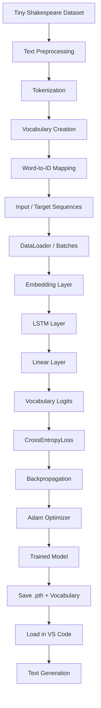
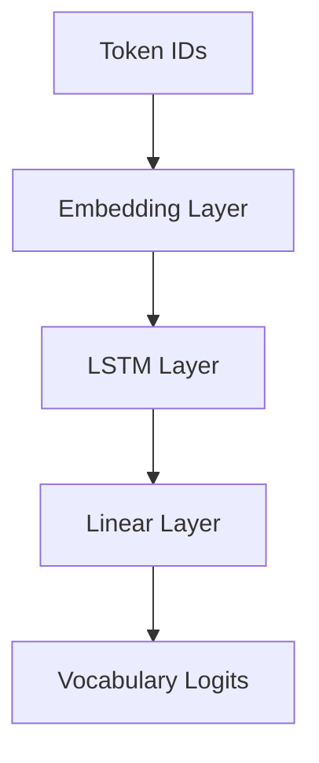
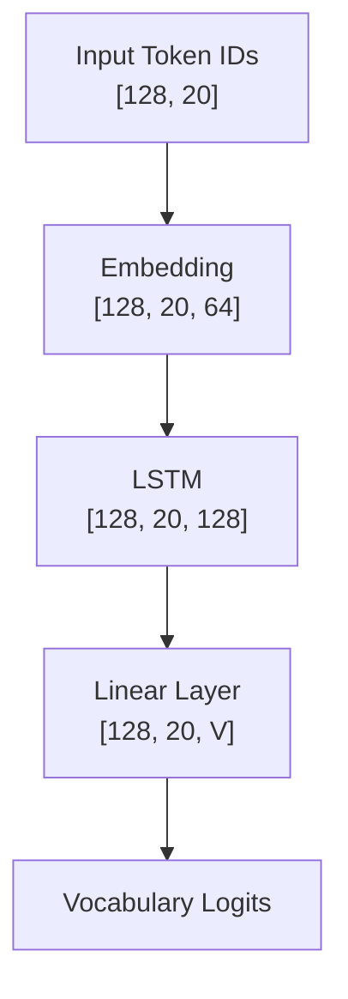
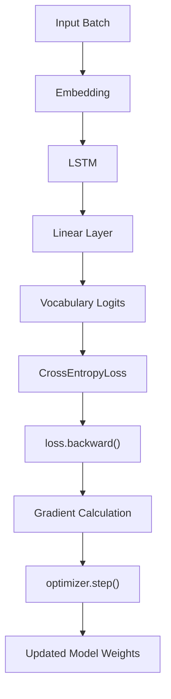
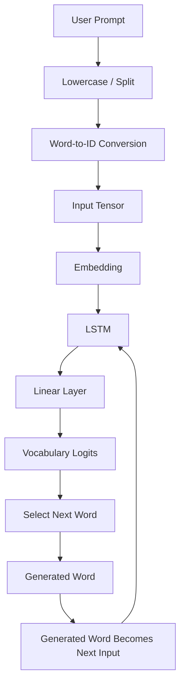

# TextGen-LSTM

A professional word-level text generation project built with **PyTorch LSTM** and trained on the **Tiny Shakespeare** dataset.

This project demonstrates the complete workflow of an LSTM language model, including preprocessing, tokenization, vocabulary creation, sequence preparation, model training, saving/loading, and autoregressive text generation.

---

## Project Objective

The goal of this project is to understand how an LSTM-based language model learns sequential patterns and predicts the next word from previous context.

Example:

```text
Input:
I love

Generated Output:
i love with mopsa thou shouldst have been a biting laws...
```

---

## Complete Workflow

> All major workflows are shown as box-based Mermaid flowcharts for a cleaner GitHub presentation.



---

## Dataset

This project uses the **Tiny Shakespeare** dataset.

It contains Shakespeare's plays and dialogues and is commonly used for sequence-modeling and language-modeling experiments.

Example raw text:

```text
From fairest creatures we desire increase
```

After preprocessing:

```text
from fairest creatures we desire increase
```

After tokenization:

```text
["from", "fairest", "creatures", "we", "desire", "increase"]
```

---

## Preprocessing

Typical preprocessing steps:

```text
Raw Text
   ↓
Lowercase Conversion
   ↓
Basic Cleaning
   ↓
Whitespace Normalization
   ↓
Word Tokenization
```

Example:

```text
"I Love Machine Learning!"

↓

"i love machine learning"

↓

["i", "love", "machine", "learning"]
```

---

## Vocabulary

Each unique word is assigned an integer ID.

Example:

```text
from       → 152
fairest    → 812
creatures  → 431
we         → 2410
```

Two mappings are used:

```text
word_to_id
id_to_word
```

Example:

```python
word_to_id["king"] = 1024
id_to_word[1024] = "king"
```

These mappings must be preserved for inference.

---

## Sequence Preparation

The model is trained using shifted input-target sequences.

Example:

```text
Input:
the king is coming home

Target:
king is coming home today
```

The model learns:

```text
the       → king
king      → is
is        → coming
coming    → home
home      → today
```

### Context Size

```text
Sequence Length / Context Size = 20 tokens
```

---

## Batching

The complete set of sequences is divided into mini-batches.

Typical batch size:

```text
Batch Size = 128
```

Input batch shape:

```text
[128, 20]
```

Where:

```text
128 = batch size
20  = sequence length
```

---

## Model Architecture



Typical configuration:

```text
Sequence Length     : 20
Embedding Dimension : 64
Hidden Size         : 128
Batch Size          : 128
Optimizer           : Adam
Learning Rate       : 0.001
Loss Function       : CrossEntropyLoss
```

---

## Tensor Flow



Where `V` is the vocabulary size.

---

## Embedding Layer

The embedding layer converts token IDs into learnable dense vectors.

```python
nn.Embedding(
    num_embeddings=vocab_size,
    embedding_dim=64
)
```

Flow:

```text
Token ID
   ↓
Embedding Vector
```

---

## Why LSTM?

A basic RNN can struggle with long-term dependencies because information may weaken across many time steps.

LSTM improves this by using:

```text
Hidden State
+
Cell State
+
Memory Gates
```

The cell state acts as long-term memory.

---

## LSTM Internal Working

At every time step, the LSTM receives:

```text
Current Input x_t
+
Previous Hidden State h_(t-1)
+
Previous Cell State C_(t-1)
```

Then it calculates:

```text
Forget Gate
Input Gate
Candidate Memory
Cell State Update
Output Gate
Hidden State
```

### Forget Gate

```text
f_t = sigmoid(W_f [h_(t-1), x_t] + b_f)
```

### Input Gate

```text
i_t = sigmoid(W_i [h_(t-1), x_t] + b_i)
```

### Candidate Memory

```text
C~_t = tanh(W_c [h_(t-1), x_t] + b_c)
```

### Cell State Update

```text
C_t = f_t * C_(t-1) + i_t * C~_t
```

Simple meaning:

```text
New Cell Memory
=
Useful Old Memory
+
Useful New Information
```

### Output Gate

```text
o_t = sigmoid(W_o [h_(t-1), x_t] + b_o)
```

Hidden state:

```text
h_t = o_t * tanh(C_t)
```

---

## Hidden State vs Cell State

```text
Cell State   = long-term memory
Hidden State = current context
```

---

## LSTM Memory Flow

For:

```text
I → love → machine → learning
```

Flow:

```text
"I"
x1 + h0 + C0
      ↓
     LSTM
      ↓
   h1 , C1

"love"
x2 + h1 + C1
      ↓
     LSTM
      ↓
   h2 , C2

"machine"
x3 + h2 + C2
      ↓
     LSTM
      ↓
   h3 , C3

"learning"
x4 + h3 + C3
      ↓
     LSTM
      ↓
   h4 , C4
```

---

## PyTorch LSTM Output

Typical usage:

```python
output, (hidden, cell) = self.lstm(embedded)
```

For a one-layer unidirectional LSTM:

```text
output = all time-step hidden states
hidden = final hidden state
cell   = final cell state
```

Shapes:

```text
output : [B, S, H]
hidden : [1, B, H]
cell   : [1, B, H]
```

---

## Linear Layer

The linear layer converts LSTM hidden features into vocabulary scores.

```python
nn.Linear(
    hidden_size,
    vocab_size
)
```

---

## Logits

The linear layer produces raw vocabulary scores called logits.

Example:

```text
king   → 4.7
queen  → 3.1
lord   → 2.8
python → -1.2
```

---

## Loss Function

This project uses:

```python
nn.CrossEntropyLoss()
```

Before loss calculation:

```text
Logits:  [B, S, V]
Targets: [B, S]
```

They are reshaped to:

```text
Logits:  [B × S, V]
Targets: [B × S]
```

---

## Optimizer

The model uses Adam:

```python
optimizer = torch.optim.Adam(
    model.parameters(),
    lr=0.001
)
```

Adam updates:

```text
Embedding Weights
LSTM Weights
LSTM Biases
Linear Layer Weights
Linear Layer Biases
```

---

## Training Workflow



Typical logic:

```python
optimizer.zero_grad()
logits = model(x_batch)
loss = criterion(logits, y_batch)
loss.backward()
optimizer.step()
```

---

## GPU Training

```python
device = torch.device(
    "cuda" if torch.cuda.is_available() else "cpu"
)

model = model.to(device)
```

Each batch is moved to the same device:

```python
x_batch = x_batch.to(device)
y_batch = y_batch.to(device)
```

---

## Saving the Model

```python
torch.save(
    model.state_dict(),
    "lstm_shakespeare.pth"
)
```

The `.pth` file stores the learned PyTorch parameters.

---

## Saving Vocabulary Mappings

```text
word_to_id.pkl
id_to_word.pkl
```

These mappings ensure that inference uses the same vocabulary as training.

---

## Loading the Model

The same architecture must be recreated before loading weights.

```python
model = LSTMTextModel(
    vocab_size=vocab_size,
    embedding_dim=64,
    hidden_size=128
)

model.load_state_dict(
    torch.load(
        "lstm_shakespeare.pth",
        map_location="cpu"
    )
)

model.eval()
```

---

## Text Generation Workflow



---

## Autoregressive Generation Example

```text
Input:
the king

↓

Prediction:
is

↓

New sequence:
the king is

↓

Prediction:
coming

↓

New sequence:
the king is coming
```

---

## Example Output

Run:

```bash
python3 generate.py
```

Input:

```text
I love
```

Example generated text:

```text
i love with mopsa thou shouldst have been a biting laws
a parlous knock and make haste and not the worst degree
to the block for you my good lord be cured
```

The output follows Shakespeare-style language because the model was trained on Tiny Shakespeare.

---

## Project Structure

```text
TextGen-LSTM/
│
├── model.py
├── generate.py
├── lstm_shakespeare.pth
├── word_to_id.pkl
├── id_to_word.pkl
├── requirements.txt
├── README.md
└── .gitignore
```

---

## File Responsibilities

### `model.py`

Defines:

```text
Embedding Layer
LSTM Layer
Linear Layer
```

### `generate.py`

Handles:

```text
Vocabulary loading
Model loading
Prompt processing
Autoregressive generation
Output printing
```

---

## Requirements

```text
torch
numpy
```

Install:

```bash
pip install -r requirements.txt
```

---

## Installation

Clone the repository:

```bash
git clone <your-repository-url>
cd TextGen-LSTM
```

Create a virtual environment:

```bash
python3 -m venv venv
```

Activate on Linux/macOS:

```bash
source venv/bin/activate
```

Activate on Windows:

```bash
venv\Scripts\activate
```

Install dependencies:

```bash
pip install -r requirements.txt
```

---

## Run the Project

```bash
python3 generate.py
```

Then enter a starting prompt:

```text
Enter starting text: I love
```

---

## Technologies Used

```text
Python
PyTorch
LSTM
Natural Language Processing
Tiny Shakespeare Dataset
Git
GitHub
```

---

## Concepts Covered

- Sequential Data
- Word-Level Language Modeling
- Text Preprocessing
- Tokenization
- Vocabulary Creation
- Word-to-ID Mapping
- ID-to-Word Mapping
- Word Embeddings
- DataLoader and Mini-Batches
- LSTM Networks
- Hidden State
- Cell State
- Forget Gate
- Input Gate
- Candidate Memory
- Output Gate
- Next-Token Prediction
- Vocabulary Logits
- CrossEntropyLoss
- Backpropagation
- Adam Optimizer
- GPU Training
- Model Saving
- Model Loading
- Autoregressive Text Generation

---

## LSTM vs Basic RNN

Basic RNN:

```text
Current Input
+
Previous Hidden State
        ↓
New Hidden State
```

LSTM:

```text
Current Input
+
Previous Hidden State
+
Previous Cell State
        ↓
Memory Gates
        ↓
New Hidden State
+
New Cell State
```

Main difference:

```text
RNN  → simple recurrent memory
LSTM → controlled long-term memory
```

---

## Limitations

This is a small word-level LSTM language model.

Possible limitations:

- grammatical errors
- repeated words
- unusual word combinations
- limited context size
- Shakespeare-style vocabulary
- no true instruction-following behavior
- no conversational reasoning
- slower sequential processing than Transformers

---

## Future Improvements

- Temperature Sampling
- Top-K Sampling
- Top-P Sampling
- Multi-Layer LSTM
- Dropout
- Validation Split
- Early Stopping
- Character-Level Modeling
- Subword Tokenization
- Larger Dataset
- Transformer Language Model
- GPT-Style Decoder Model

---


## Author

**A. Bala Srinu**

B.Tech Information Technology Student

Areas of interest:

```text
Artificial Intelligence
Machine Learning
Deep Learning
Natural Language Processing
Generative AI
```

---

## Project Purpose

This project was developed as a practical deep-learning project to understand how LSTM networks process sequential text, preserve information using hidden and cell states, learn next-token relationships, and perform autoregressive text generation.

It is intended as a learning-focused implementation before progressing to **Attention, Transformers, and GPT-style language models**.

---

## License

This project is created for educational and learning purposes.
